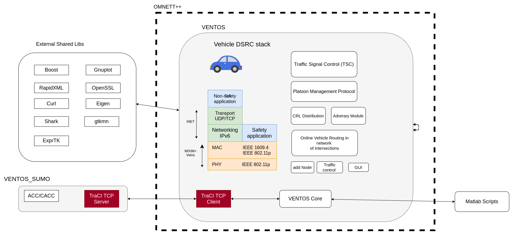

# Problem statement
Simulation of V2X communication system using DSRC framework with WLAN and Analysis of how vehicles transfer data within less period time.

# Introduction

* V2X is a technology not only allows vehicles to “talk” to each other but also gets the information from environment.
* V2X are an emerging type of networks in which nearby vehicles exchange the data wirelessly in real time.
* They share information like traffic updates, collision to ensure a safer and more comfortable drive.

# Motivation
* In the current scenario, 5g technology is used for network communication in autonomous cars. Due to this technology there’s a communication lag between two systems. To resolve this problem we are using WLAN (wireless local area network) with DSRC (Dedicated short range communication technology .
* 5g is an open network .Open networks are usually prone to hacking. To resolve this we use WLAN with security.
* In the present technology there’s a latency (such as processing delay and delay due to contention) in communication. In this project we’ll use faster WiFi modules and reduce the latency in order to achieve seamless connection.

# Objectives

* Design and simulation of the environment files using OMNETT++.
* Building of the network communication system using SUMO.
* Development and implementation of code for behavioral pattern setting.
* Implementation of V2X communication and analysis of the complete system.

# Methodology

* Setting Up OMNET++ and linking it with GCC, configuring terminal with G++ path and OMENT++ path.
* Once the configurations are done, a gui-controller gets initiated where communication between the cars and the environment (i.e traffic signals, collision information etc) is visible.
* Using OMNETT++, environment (ie .env) files can be created to simulate cars and environment (i.e maps, trees, road).
* Generating a DSRC network framework which consist of junction (i.e nodes), server can be done using SUMO.

# Tools Required

* C Language
* Python
* OMNETT++
* Sumo
* INET
* Veins(Vehicles in Network Simulation)
* Network simulator (used in OMNETT++)
* Matlab lib (used in OMNETT++)

# Simulation

### RSU to RSU communication
Input parameters

# Ventos Architecture

VENTOS is an integrated simulator based on two well-known simulators: SUMO and OMNET++.

* **SUMO** (Simulation of Urban Mobility) is an open-source, microscopic, continuous-space, discrete-time C++ road traffic simulator, developed by Institute of Transportation Systems at the German Aerospace Center and adopted as our vehicular traffic simulator. VENTOS is closely coupled withSUMO through TraCI (Traffic Control Interface) and uses the mobility information of cars, bikes and pedestrians to perform realistic simulation. We believe that SUMO is as powerful as a Sumo
wrestler.
* **OMNET++** is an open-source, extensible, modular, component-based C++ simulation package and captures the wireless communication simulation. IEEE 802.11p physical layer modeling and IEEE 1609.4 are implemented in the Veins (Vehicles in Network Simulation) framework and is used for wireless V2X communication between different modules. Many well-known TCP/IP protocols can be added from INET framework. Figure shows the VENTOS architecture.

The functionality of the modules depicted in Figure is described in the following:
* **VENTOS_SUMO:** Implements additional car-following models for ACC/CACC vehicles in SUMO and extends the TraCI commands which connects SUMO to an external application.

* **Traffic Signal Control (TSC):** This module implements many of the Traffic Signal Control (TSC) algorithms that is being used nowadays in intersections such as fix-time and traffic-actuated or algorithms developed in research community such as adaptive Webster, Longest Queue First (LQF), Oldest Job First (OJF), Maximum weight Matching (MWM).

* **Platoon Management Protocol:** This module implements a platoon management protocol that supports different maneuvers such as merge, split, entry, follower leave, platoon leader leave.

* **Certificate Revocation List (CRL) Distribution:** This module implements many of the well-known CRL distribution algorithms in Vehicular PKI architecture such as RSU-only, C2C Epidemic, Most- Pieces Broadcast (MPB), Intelligent CRL Exchange (ICE), etc.

* **Adversary Module:** You can use this module to study security attacks specially in collaborative driving. 

* **Online Vehicle Routing:** This module implements dynamic traffic routing algorithms using real-time traffic information to reduce the average delay as well as fluctuation of the average speed within the whole network. 

* **addNode:** This module allows you to add different nodes such as RSUs, obstacles, vehicle flow, etc. to the simulation environment.

* **trafficControl:** This module allows you to change the speed of a vehicle or coordinate a platoon.

* **gui:** This module allows you to change viewport and track a specific vehicle in the simulation.

* **VENTOS Core:** VENTOS core is responsible for orchestrating all internal modules. It is also responsible for initiating the TraCI interface with SUMO as well as logging simulation results into text files. These output files can be fed into Matlab scripts for post-processing.

VENTOS uses the following libraries:

* **Boost:** Boost provides free peer-reviewed portable C++ source libraries. We are using boost filesystem, circular buffer, tokenizer, and graph.

* **RapidXML:** RapidXml is an attempt to create the fastest XML parser possible, while retaining usability, portability and reasonable W3C compatibility. It is an in-situ parser written in modern C++, with parsing speed approaching that of strlen function executed on the same data. RapidXML is a header only library, and is already included in VENTOS source code.

* **Curl:** Curl is a library for transferring data with URL syntax, supporting many different networking protocols. We use this library to download the latest SUMO binaries from Internet.

* **Eigen:** Eigen is a C++ template library for linear algebra: matrices, vectors, numerical solvers, and related algorithms. We use this library for matrix calculations.

* **Shark:** Shark is a fast, modular, feature-rich open-source C++ machine learning library. It provides methods for linear and nonlinear optimization, kernel-based learning algorithms, neural networks, and various other machine learning techniques. 

* **Gnuplot:** Gnuplot is a portable command-line driven interactive plotting program. 

* **OpenSSL:** OpenSSL is an open-source implementation of the SSL and TLS protocols. The core library, written in the C programming language, implements the basic cryptographic functions and provides various utility functions. We use OpenSSL library to sign and verify different messages.

* **gtkmm:** gtkmm is the official C++ interface for the popular GUI library GTK+. We use this library to create the output message log window.

* **ExprTk:** The C++ Mathematical Expression Toolkit Library (ExprTk) is a simple to use, easy to integrate and extremely efficient run-time mathematical expression parser and evaluation engine. It supports numerous forms of functional, logical and vector processing semantics and is very easily extendible. We use this library to evaluate speed functions.

# Applications

* Collision Allert
* Road conditions warning
* Merge assistance
* Deceleration warning
* GPS
* Toll Roads
* Cruise control

# Reference

* Byun Seungbok , Kang Sangpil , Hong Choulhee , Kim Heeyoung ; Kim yoongi “Design of a V2X Vehicle Antenna” Date of Conference: 23-26 Oct. 2018, ISBN: 978-89-5708-304-8

* Erwin Anggadjaja , Ian Mcloughlin “Point-to-Point OMNeT++ Based Simulation of Reliable Transmission Using Realistic Segmentation and Reassembly with Error Control” Date of Conference: 2-3 Dec. 2010 ISBN: 978-1-4244-8746-2 .

* Mohammad Kawser, Syed Safwan Sajjad, Saymon Fahad, Sakib Ahmed “The Perspective of Vehicle-to-Everything (V2X) Communication towards 5G” JSCNS International Journal of computer Science and network security VOL.19 No.4, April 2019.

* Muhammad Ali Imran ; Yusuf Abdulrahman Sambo ; Qammer H. Abbasi “Evolution of Vehicular Communications within the Context of 5G Systems” Publisher:Wiley-IEEE Press ISBN: 9781119515579 , 2019
